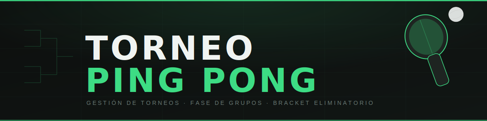

  

---

Aplicación web para organizar torneos de ping pong. Sin backend, sin instalación — todo corre en el navegador.

## Características

- **8 a 16 equipos** con agrupación automática adaptativa
- **Fase de grupos** con tabla de posiciones en tiempo real
- **Bracket eliminatorio** — cuartos, semis, final y 3er puesto
- **Progreso guardado** en localStorage (sobrevive recargas)
- Funciona 100% offline y en GitHub Pages

## Uso

1. Abrí [la app](https://recamm.github.io/PingPong/)
2. Ingresá el nombre del torneo y los equipos (mín. 8)
3. Cargá los resultados de cada partido
4. El bracket se arma solo

## Tecnologías

HTML · CSS · JavaScript vanilla
